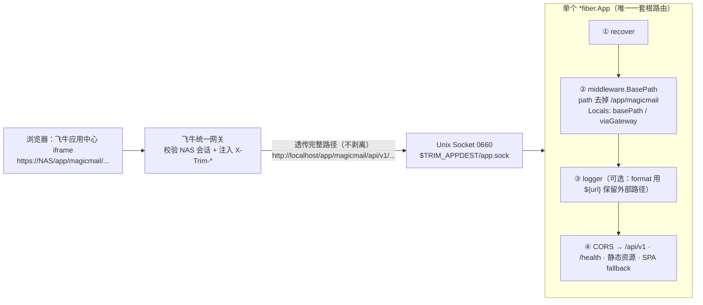

# 计划：统一网关单入口（仅 Unix Socket）+ 前缀剥离（后端单套根路由）

> 目标（一句话）：**飞牛形态只监听 Unix Socket**，飞牛统一网关透传的 `/app/magicmail` 前缀由一个前置中间件剥离，
> 后端只维护一套根路由；网关已做 NAS 级认证，可直接凭 `X-Trim-Userid` 免密登录已绑定账号。
> **不再提供飞牛形态的 TCP 端口**——需要端口访问请部署非飞牛版本（Docker / `build.sh`）。
>
> 关联文档：`docs/fnos-gateway-integration-plan.md`（网关接入）、`docs/dual-listen-tcp-unix-plan.md`（双监听，**本计划将其废弃**）。

---

## 0. TL;DR

| 问题 | 结论 |
|---|---|
| Go 能否主动剥离 `/app/magicmail` 再处理？ | **能，已实测通过**（§3.1）。Fiber v2 中间件里 `c.Path(rest)` + `c.Next()` 后，后续路由按新路径匹配。**唯一约束：必须是第一个 `app.Use`，早于任何路由注册。** |
| 飞牛形态还要不要 TCP 端口？ | **不要**。网关已完成 NAS 级认证，TCP 属于无保护的额外暴露面。需要端口就部署非飞牛版本。 |
| 网关免密登录如何实现？ | 网关（Unix Socket）入口读 `X-Trim-Userid`；`GatewayIdentity` 以**连接来源**（`Network()=="unix"`）为信任边界。 |
| 前端静态资源 / 接口要不要去掉 `/app/magicmail`？ | **浏览器发出的 URL 必须带前缀**（网关按 `gatewayPrefix` 转发）；**后端 Go 代码不需要任何前缀逻辑**。二者不矛盾，详见 §4。 |
| 只剩 socket 后最大的安全风险是什么？ | **socket 文件权限**。当前 `0666` 意味着 NAS 上任意本地进程都能连它并伪造 `X-Trim-Userid`。因此 **0666 → 0660 从「可选加固」升级为「必做」**（§6.7）。 |

---

## 1. 目标与非目标

### 1.1 目标

1. **飞牛形态单入口**：只监听 `TRIM_APPDEST/app.sock`，移除「同时开启 TCP 端口」的向导选项与后端注入。
2. **网关入口免登录**：已绑定飞牛用户的账号，打开应用即凭 `X-Trim-Userid` 免密登录（`/api/v1/auth/fnos/*` 能力不变）。
3. **后端单套根路由**：`/api/v1/**`、`/health`、静态资源、SPA fallback 全部只注册一次；网关前缀由中间件剥离。
4. **收紧 socket 权限**：`0666` → `0660`，使「非授权本地进程无法冒充网关」成为可依赖的安全边界。
5. **非飞牛版本零影响**：Docker / `build.sh` 构建全程无前缀，行为与改造前完全一致（§6.11）。

### 1.2 非目标

- **不再提供飞牛形态的 TCP 端口**（含 `both` 模式与向导选项）。
- **不再提供飞牛应用配置向导**（`wizard/config` 删除）：单入口模式下无运行时可配置项。
- 不改动 `gatewayPrefix` / `gatewaySocket` / `desktop_uidir` 等飞牛侧入口配置。
- 不改动 «绑定关系一对一»、«SSE 用 JWT 鉴权» 等既有设计。
- 不引入 Cookie / Session。
- 不删除后端的通用多监听能力（§6.5，保留给自建部署，飞牛侧不再使用）。

### 1.3 为什么去掉 TCP 端口（决策依据）

| 维度 | TCP 端口（both 模式） | 仅统一网关 |
|---|---|---|
| 认证层 | 只有应用自身 JWT，无 NAS 级前置认证 | 飞牛网关已校验 NAS 会话，并注入 `X-Trim-Userid` |
| 暴露面 | 局域网任意设备可访问登录页，可尝试爆破账密 | 仅 NAS 已登录用户可见 |
| 网关身份伪造 | 局域网任何人可 `curl -H 'X-Trim-Userid: 1'` 免密进入（§2.2） | 攻击面收敛到「能否连上 socket」 |
| 端口管理 | 需用户配置端口、防火墙放行、`checkport` 语义冲突 | 无端口，零配置 |
| 替代方案 | — | 需要端口访问的直接部署非飞牛版本（Docker / `build.sh`），职责清晰 |

---

## 2. 现状与问题

### 2.1 现状代码

| 位置 | 现状 |
|---|---|
| `fnapp/manifest` | `gatewayPrefix = /app/magicmail`、`gatewaySocket = app.sock`、`checkport = false` |
| `fnapp/app/ui/config` | `type: iframe`、`url: /app/magicmail`、`allUsers: true` |
| `fnapp/wizard/install`、`wizard/config` | 含「访问方式设置」步骤：`listen_mode`（gateway/both）+ `tcp_port`（默认 23232） |
| `fnapp/cmd/main` | 始终注入 `MAGICMAIL_LISTEN=unix://${SOCK}`；`both` 时额外注入 `MAGICMAIL_TCP_ENABLED=1` / `MAGICMAIL_TCP_ADDR`；注入 `MAGICMAIL_BASE_PATH=/app/magicmail`；socket 权限 `0666` |
| `server/config/config.go` | `Listen` / `TCPEnabled` / `TCPAddr` / `BasePath` 四个字段 |
| `server/main.go` | 主监听阻塞 + TCP 放 goroutine；中间件顺序 `recover → logger → routes.Register` |
| `server/routes/routes.go` | **双注册**：`prefixes = [""]`，`BasePath` 非空时追加 `/app/magicmail`，循环注册全部路由；静态资源用「候选路径」兼容两种前缀 |
| `server/middleware/auth.go` | `GatewayIdentity()` 只要存在 `X-Trim-Userid` 就返回身份，不校验连接来源 |
| `web/vite.config.js` | `base = BASE_URL`（FPK 构建为 `/app/magicmail`，Docker 为 `/`） |
| `web/src/api/request.js` | `baseURL = import.meta.env.BASE_URL + 'api/v1'`；兜底跳转 `window.location.href = '/login'`（硬编码，带前缀部署会跳错） |

### 2.2 问题一：TCP 端口可被伪造网关身份免密登录（本次通过「移除 TCP」根除）

`GatewayIdentity` 只看 Header：

```go
func GatewayIdentity(c *fiber.Ctx) (fnosUID string, username string, ok bool) {
	fnosUID = c.Get("X-Trim-Userid")
	if fnosUID == "" {
		return "", "", false
	}
	username = c.Get("X-Trim-Username")
	return fnosUID, username, true
}
```

而 `/api/v1/auth/fnos/*` 被双注册到了根路径，因此 `both` 模式下：

```bash
curl -H 'X-Trim-Userid: 1' http://<飞牛IP>:23232/api/v1/auth/fnos/login
```

即可拿到该飞牛用户所绑定账号的 JWT（`FnosLogin` 全程无密码，`handlers/auth_handler.go:126-145`）。
即：**局域网内任何人只要知道端口，就能以任意已绑定飞牛用户身份进入应用。**

> `docs/fnos-gateway-integration-plan.md:40` 声称「伪造 Header 在普通 TCP 端口路由下无效」，
> 该结论在「双注册 + TCP 监听」前提下**不成立**。
> **处置**：本次直接移除 TCP 入口（根因消除），同时保留连接来源判定作为纵深防御（§6.4）。

### 2.3 问题二：socket 权限 0666 是新的唯一身份伪造入口

移除 TCP 后，「谁可以冒充网关」完全等价于「谁能连上 `app.sock`」。
当前 `server/main.go:142` 为 `_ = os.Chmod(sockPath, 0666)`，意味着 NAS 上**任意本地进程**
（第三方应用、任意可登录用户）都能连它并伪造 `X-Trim-Userid: 1`。

⇒ 因此 **0660 从可选加固升级为必做项**（§6.7），且必须真机验证网关进程仍能连接。

### 2.4 问题三：双注册的维护成本（本次消除）

`routes.go:76-95` 把全部 API（约 60 条）、`/health`、静态资源、SPA fallback 注册两遍，
静态处理器还要自己算「候选路径」（`routes.go:291-298`）。路由表面积 ×2，任何新增端点都要同步两份。

### 2.5 需订正的既有结论

| 文档 | 位置 | 原结论 | 订正 |
|---|---|---|---|
| `docs/fnos-gateway-integration-plan.md` | :127 | 「Fiber 路由匹配发生在中间件之前，前缀剥离中间件不可行，必须双注册」 | **错误，已实测推翻**（§3.1） |
| `docs/fnos-gateway-integration-plan.md` | :40 / :218 / :228 | 「伪造 Header 在普通 TCP 端口路由下无效」 | 在双注册前提下不成立（§2.2） |
| `docs/dual-listen-tcp-unix-plan.md` | 全文 | 「通过向导选择是否同时开启 TCP 端口」 | **整体废弃**：飞牛形态只走网关，需要端口请部署非飞牛版本（§11） |

---

## 3. 关键原理

### 3.1 Fiber v2 能在中间件里剥离前缀（**已实测通过**）

- `app.Use` 中间件与 `app.Get/Group` 路由**同处 `app.stack`**，按注册顺序排列；
- `app.next(c)` 从 `c.indexRoute` 起逐条 `route.match(c.detectionPath, ...)`；
- `c.Path(newPath)` 内部执行 `URI().SetPath()` 并重算 `c.path` / `c.detectionPath` / `c.treePath`；
- handler 里 `c.Next()` 会**再次进入 `app.next(c)`**，用新的 `detectionPath`/`treePath` 重新选桶继续向后遍历。

**实测记录**（`server/middleware/tmp_strip_probe_test.go`，验证后已删除）：

```go
app.Use(func(c *fiber.Ctx) error {
    if strings.HasPrefix(c.Path(), "/app/magicmail") {
        c.Path(strings.TrimPrefix(c.Path(), "/app/magicmail"))
    }
    return c.Next()
})
app.Get("/api/v1/ping", func(c *fiber.Ctx) error { return c.SendString("pong:" + c.Path()) })
// GET /app/magicmail/api/v1/ping
```

```
=== RUN   TestStripProbe
    tmp_strip_probe_test.go:32: status=200 body="pong:/api/v1/ping"
--- PASS: TestStripProbe (0.00s)
ok  	magicmail/middleware	0.005s
```

⇒ **方案地基成立**（Fiber v2.52.13）。

**硬约束**：`c.indexRoute` 只前进不回退，因此剥离中间件**必须注册在所有路由之前**。

### 3.2 用连接来源判定「是否来自网关」

```go
c.Context().Conn().RemoteAddr().Network() // Unix Socket → "unix"；TCP → "tcp"
```

- 可靠：不受客户端控制；
- 不依赖路径：即使将来重新引入 TCP，或经反代访问，判定依然正确。

> `app.Test()` 使用 `fasthttputil.InmemoryListener`，`Network()` 既非 `unix` 也非 `tcp`，
> 默认判定为「非网关」（安全默认）。单测通过替换包级变量 `gatewayConnCheck` 覆盖两个分支。

### 3.3 剥离（路径层）与信任（连接层）解耦

| 维度 | 判定依据 | 行为 |
|---|---|---|
| **是否剥离前缀** | 只看**路径**是否以 `/app/magicmail` 开头 | 任何入口都剥离 |
| **是否信任 `X-Trim-*`** | 只看**连接**是否 unix | 仅 unix 信任 |

剥离必须按路径而非按来源：前端构建产物里的资源与 API 路径**恒带前缀**，
且需兼容「部分网关版本可能剥离前缀」的行为——按路径判断在两种行为下都正确（场景 7/9）。

---

## 4. 前缀的三层语义（为什么前端 `BASE_URL` 必须保留）★

| 层 | 是否需要 `/app/magicmail` | 原因 |
|---|---|---|
| **① 浏览器发出的 URL**（含前端产物里的资源、API、PWA、`<base href>`） | **必须需要** | 网关按 `gatewayPrefix` 决定转发给哪个 socket。不带前缀的请求根本不会到我们应用，会落到 NAS 站点根路径 → 404 |
| **② 后端 Go 路由注册** | **不需要** | 剥离中间件统一去掉前缀，后端只注册 `/api/v1/**` 等根路由 |
| **③ 后端读取静态资源（`embed.FS`）** | **不需要** | 按剥离后的路径直接读 `dist/assets/...` |
| **④ 前端 Vite `base`（构建期 `BASE_URL`）** | **保持 `/app/magicmail`** | 它决定的正是 ①——浏览器实际发出的 URL 前缀 |

⇒ 「前端静态资源 / 后端接口不需要加前缀」的**正确落地方式**是：
**后端代码（②③④）彻底去掉前缀逻辑，前端构建配置（①）保持不变。**

若把 `BASE_URL` 改成 `/`，通过网关访问时 `index.html` 里资源路径变为 `/assets/xxx.js`
→ 浏览器请求 `https://<NAS>/assets/xxx.js` → 网关匹配不到应用 → 404 白屏。

---

## 5. 目标架构

### 5.1 架构图



> **没有 TCP Listener**。需要端口访问的场景使用非飞牛版本（Docker / `build.sh`），其 `MAGICMAIL_BASE_PATH`
> 为空、前端 `base='/'`，全程无前缀（§6.11）。

### 5.2 场景矩阵（改造后必须全部成立）

| # | 入口 | 请求 | 剥离后 | 结果 |
|---|---|---|---|---|
| 1 | 网关 | `GET /app/magicmail/` | `/` | SPA fallback → index.html |
| 2 | 网关 | `GET /app/magicmail/assets/app.js` | `/assets/app.js` | 静态资源命中 |
| 3 | 网关 | `GET /app/magicmail/api/v1/mails` + `Authorization` | `/api/v1/mails` | 200 |
| 4 | 网关 | `POST /app/magicmail/api/v1/auth/fnos/login`（unix 连接） | `/api/v1/auth/fnos/login` | **免密签发 JWT** |
| 5 | 网关 | `GET /app/magicmail/health` | `/health` | 200（网关探活） |
| 6 | 网关 | `GET /app/magicmail/sw.js` | `/sw.js` | 200（PWA） |
| 7 | 网关（若其剥离前缀） | `GET /api/v1/auth/status` | 不剥离 | 200（兼容两种网关行为） |
| 8 | 边界 | `GET /app/magicmailx/...` | 不剥离 | 走 SPA fallback / 404，不误伤 |
| 9 | Docker（非飞牛） | `GET /`（`base='/'`、无前缀可剥） | `/` | 200，行为与改造前一致 |
| 10 | 任意 | `GET /app/magicmail/mails/123`（SPA 深链） | `/mails/123` | 200 index.html |

### 5.3 身份伪造矩阵（唯一入口 = socket 之后）

| 连接方 | `Network()` | `0666`（现状） | `0660`（目标） |
|---|---|---|---|
| 飞牛网关进程 | `unix` | 可连 ✓ | 可连 ✓（**需真机验证**） |
| NAS 上其他用户 / 第三方应用进程 | `unix` | **可连并可伪造 `X-Trim-Userid`** ✗ | 连接被拒 ✓ |
| 局域网设备（无端口） | — | 无法连（无 TCP 监听）✓ | 无法连 ✓ |

---

## 6. 详细改动

### 6.1 新增 `server/middleware/basepath.go`

```go
// SPDX-License-Identifier: AGPL-3.0-or-later
// Copyright (C) 2026  magiccode (魔法代码)

package middleware

import (
	"strings"

	"github.com/gofiber/fiber/v2"
)

// 请求级 Locals key
const (
	localsBasePath   = "basePath"   // 本次请求被剥离的公开前缀（如 /app/magicmail）；未剥离为 ""
	localsViaGateway = "viaGateway" // 本次请求是否来自飞牛统一网关（Unix Socket 连接）
)

// gatewayConnCheck 判定连接是否来自统一网关：只有 Unix Socket 连接才是网关。
// 抽成包级变量以便单测替换（app.Test 用内存 listener，拿不到 unix 连接）。
var gatewayConnCheck = func(c *fiber.Ctx) bool {
	conn := c.Context().Conn()
	if conn == nil {
		return false
	}
	if addr := conn.RemoteAddr(); addr != nil {
		return addr.Network() == "unix"
	}
	return false
}

// BasePath 剥离飞牛统一网关透传的公开前缀（manifest.gatewayPrefix），
// 使后端只需维护一套根路由：/api/v1/**、/health、静态资源、SPA fallback。
//
// ⚠️ 注册顺序约束：必须在任何路由（app.Get / app.Group）之前 app.Use。
// Fiber 的路由栈只前进不回退，注册晚于路由的中间件不参与这些路由的匹配。
//
// 行为：
//   - 路径 == prefix 或以 prefix+"/" 开头 → 剥离，Locals(basePath)=prefix
//   - 其余路径（含 /app/magicmailx/...）→ 原样，Locals(basePath)=""
//   - prefix 为空（Docker / 非飞牛部署）→ 完全透传，仅写 Locals
//   - 无论来源，均写入 Locals(viaGateway)=是否为 Unix Socket 连接
func BasePath(prefix string) fiber.Handler {
	canonical := ""
	if p := strings.Trim(prefix, "/"); p != "" {
		canonical = "/" + p
	}

	return func(c *fiber.Ctx) error {
		c.Locals(localsViaGateway, gatewayConnCheck(c))

		if canonical == "" {
			// 非飞牛部署：无前缀概念，保持零行为差异
			c.Locals(localsBasePath, "")
			return c.Next()
		}

		p := c.Path()
		if p == canonical || strings.HasPrefix(p, canonical+"/") {
			rest := strings.TrimPrefix(p, canonical)
			if rest == "" || rest[0] != '/' {
				rest = "/" + rest
			}
			c.Locals(localsBasePath, canonical)
			c.Path(rest) // 重写路径 → 后续栈内路由按剥离后的路径匹配
		} else {
			c.Locals(localsBasePath, "")
		}
		return c.Next()
	}
}

// GetBasePath 返回本次请求被剥离的公开前缀（未剥离为 ""）。
// 生成「对外可见的绝对 URL / 重定向」时必须用它把前缀补回去。
func GetBasePath(c *fiber.Ctx) string {
	s, _ := c.Locals(localsBasePath).(string)
	return s
}

// IsGatewayRequest 判定请求是否来自飞牛统一网关（Unix Socket 连接）。
// 非 Unix Socket 入口（自建 TCP 部署 / app.Test）即使携带 X-Trim-* 也返回 false。
func IsGatewayRequest(c *fiber.Ctx) bool {
	b, _ := c.Locals(localsViaGateway).(bool)
	return b
}
```

> 相比早期版本**移除了 `forceRedirect` 参数与 `isRedirectExempt`**：飞牛形态只有网关入口，
> 请求恒带前缀，不存在「无前缀访问需要补齐」的场景；非飞牛形态 `prefix` 为空。故无需该开关。

### 6.2 `server/main.go`：调整中间件注册顺序

```go
	// 全局中间件
	app.Use(recover.New())

	// ⭐ 前缀剥离：必须早于任何路由注册（含 logger / CORS / routes.Register）
	app.Use(middleware.BasePath(cfg.Server.BasePath))

	// Logger：排除 SSE 流端点。此时 c.Path() 已是剥离后的内部路径。
	app.Use(logger.New(logger.Config{
		Next:   func(c *fiber.Ctx) bool { return c.Path() == "/api/v1/mails/stream" },
		Output: logWriter,
		// 建议：Format 中把 ${path} 换成 ${url}（= OriginalURL），
		// 日志保留浏览器看到的外部路径，便于排障（c.OriginalURL() 不受 Path 重写影响）
	}))

	routes.Register(app, db)
```

### 6.3 `server/routes/routes.go`：删除双注册

1. 删除 `prefixes` 循环，改为单次调用：

```go
	// 单套根路由：网关透传的 /app/magicmail 前缀已由 main.go 中的
	// middleware.BasePath 统一剥离，这里只需注册根路径。
	registerAppRoutes(app, routeDeps{
		accountHandler:    accountHandler,
		// ... 其余 handler 不变
	})
```

2. `registerAppRoutes` 去掉 `prefix` 参数：`app.Group(prefix + "/api/v1")` → `app.Group("/api/v1")`;
   `app.Get(prefix+"/health", ...)` → `app.Get("/health", ...)`。

3. 静态资源：删掉「候选路径」逻辑（`routes.go:291-298`），只按剥离后的 `c.Path()` 读 `embed.FS`：

```go
func serveFrontendOnce(app *fiber.App) {
	if !isEmbedded() {
		return
	}
	distSub, err := fs.Sub(embedfs.DistFS, "dist")
	if err != nil {
		return
	}

	// 静态资源：c.Path() 已被剥离前缀，形如 /assets/app.js、/sw.js、/icons/icon-192x192.png
	app.Use(func(c *fiber.Ctx) error {
		if c.Method() != fiber.MethodGet && c.Method() != fiber.MethodHead {
			return c.Next()
		}
		p := c.Path()
		if strings.HasPrefix(p, "/api/") || p == "/health" {
			return c.Next()
		}
		clean := path.Clean(strings.TrimPrefix(p, "/"))
		if clean == "" || clean == "." || !fs.ValidPath(clean) || strings.HasPrefix(clean, "..") {
			return c.Next() // 根路径交给 SPA fallback
		}
		data, err := fs.ReadFile(distSub, clean)
		if err != nil {
			return c.Next()
		}
		c.Type(path.Ext(clean))
		return c.Send(data)
	})

	// SPA fallback：其余 GET/HEAD 返回 index.html；未命中的 API 返回 404 JSON
	app.Use(func(c *fiber.Ctx) error {
		if c.Method() != fiber.MethodGet && c.Method() != fiber.MethodHead {
			return c.Status(fiber.StatusNotFound).JSON(fiber.Map{"error": "Not Found"})
		}
		p := c.Path()
		if strings.HasPrefix(p, "/api/") || p == "/health" {
			return c.Status(fiber.StatusNotFound).JSON(fiber.Map{"error": "Not Found"})
		}
		return serveIndexHTML(c)
	})
}
```

4. 开发态 `serveFrontend` 去掉 `cfg` 参数与前缀分支：`app.Static("/", "./dist")`。
5. `Register()` 中 `cfg` 仍保留（Service 初始化需要），`config` import 无需删除。

### 6.4 `server/middleware/auth.go`：以连接来源作为信任边界（纵深防御）

```go
func GatewayIdentity(c *fiber.Ctx) (fnosUID string, username string, ok bool) {
	if !IsGatewayRequest(c) {
		// 非 Unix Socket 入口（自建 TCP 部署 / Docker / app.Test）：一律不认 X-Trim-*，伪造无效
		return "", "", false
	}
	fnosUID = c.Get("X-Trim-Userid")
	if fnosUID == "" {
		return "", "", false
	}
	username = c.Get("X-Trim-Username")
	return fnosUID, username, true
}
```

同步更新文档注释（原注释说「由路由层保证只在网关前缀下调用」，改为「由连接来源保证」）。

> 移除 TCP 后该问题已根除，此改动属**纵深防御**：成本一行，可防止将来重新引入 TCP、
> 或 Docker 场景下反向代理注入 `X-Trim-*` 时被误信。

### 6.5 `server/config/config.go`：语义明确化

```go
type ServerConfig struct {
	Port       int
	Host       string
	Listen     string // 完整监听地址：空或 "tcp://HOST:PORT"（默认）；"unix:///path/app.sock"（飞牛统一网关）
	TCPEnabled bool   // 是否在主监听之外并行监听 TCP（⚠️ 飞牛形态不再使用，仅供自建部署）
	TCPAddr    string // 并行 TCP 地址（⚠️ 同上）
	BasePath   string // 统一网关透传的公开前缀（如 /app/magicmail）。后端只注册根路由，
	//               由 middleware.BasePath 在匹配前剥离该前缀。为空表示部署在根路径。
}
```

- `MAGICMAIL_BASE_PATH` **语义变化**：从「据此双注册带前缀路由」改为「据此剥离前缀」。
  变量值与注入方式不变（`fnapp/cmd/main` 仍注入 `/app/magicmail`），Docker 仍不设置。
- `TCPEnabled` / `TCPAddr` / `listenAndServe` **代码保留、行为不变**，但飞牛侧不再注入（§6.6），
  因此在飞牛形态下恒为 false —— 保留是为了自建部署（如 socket + 本地 TCP）仍可用。

### 6.6 飞牛侧：移除 TCP 相关能力

#### `fnapp/cmd/main`

```bash
    # 飞牛形态只通过统一网关访问（Unix Socket），不再提供 TCP 端口：
    # 网关已完成 NAS 级认证，额外暴露端口等于开放一个无保护的登录入口。
    # 需要端口访问请部署非飞牛版本（Docker / build.sh）。
    export MAGICMAIL_DSN="${DB_PATH}"
    export MAGICMAIL_LISTEN="unix://${SOCK}"
    export MAGICMAIL_BASE_PATH="/app/magicmail"

    # 显式清除：防止从父进程环境或旧版本残留中继承，导致端口被意外监听
    unset MAGICMAIL_TCP_ENABLED MAGICMAIL_TCP_ADDR
```

并删除 `start_process()` 中读取 `fnos_listen_mode` / `fnos_tcp_port` 的整段逻辑
（含端口合法性兜底与 `LISTEN_MODE` 分支）及诊断日志中的 `fnos_listen_mode` 行。

#### `fnapp/wizard/install`

只保留「欢迎安装」步骤，**删除整个「访问方式设置」步骤**（`listen_mode` radio + `tcp_port` text）：

```json
[
  {
    "stepTitle": "欢迎安装 Magicmail",
    "items": [
      { "type": "tips", "helpText": "欢迎使用 Magicmail 魔法邮箱！Magicmail 基于 IMAP 协议，支持多邮箱账号的统一管理和实时邮件推送。" },
      { "type": "tips", "helpText": "本应用通过飞牛统一网关访问，不占用额外端口。访问 <a target=\"_blank\" href=\"https://github.com/magiccode1412/magicmail\">GitHub</a> 了解更多信息。" }
    ]
  }
]
```

#### `fnapp/wizard/config`：**删除文件**

删除访问方式后该向导已无任何可配置项（原文件只有 `listen_mode` + `tcp_port` 两个字段），
因此**整个文件删除**，应用设置页不再提供配置项。

> 飞牛的 `wizard/` 下各向导文件（`install` / `upgrade` / `uninstall` / `config`）均为可选，缺失即表示「无此向导」。

#### `fnapp/cmd/config_callback`：**改为 no-op（保留文件）**

```bash
#!/bin/bash

### This script is called after the user change environment variables in application setting page.
### 已移除配置向导（wizard/config）：应用无运行时可配置项，统一网关模式下无需重启。
### 保留本脚本为空实现，避免平台在缺失该回调时报错。

exit 0
```

> 与 `config_init`（已是 `exit 0`）保持一致。**保留空脚本而非删除**，是因为平台侧流程可能仍会调用它，
> 缺失文件的风险大于保留一个空实现。

`fnapp/cmd/config_init` 保持现状（已是 `exit 0`）。

#### `fnapp/manifest`

`changelog` 顶部补充（并移除上一条关于「同时开启 TCP 端口」的描述）：

```
- 仅通过飞牛统一网关访问：移除「同时开启 TCP 端口」选项与应用配置向导，网关已完成 NAS 级认证，避免额外的无保护暴露面；需要端口访问请部署 Docker / 独立版本
- 后端路由改为单套根路由，统一网关透传的 /app/magicmail 前缀由服务端自动剥离
- Unix Socket 权限收紧为 0660，仅应用与网关可访问
```

`gatewayPrefix` / `gatewaySocket` / `checkport=false` 保持不变。

### 6.7 socket 权限 0666 → 0660（**必做**）

`server/main.go:142`：

```go
_ = os.Chmod(sockPath, 0660) // 原为 0666
```

**为什么必做**：移除 TCP 后，socket 是唯一入口；`0666` 意味着 NAS 上任意本地进程都能连它
并伪造 `X-Trim-Userid: 1` 免密进入任意已绑定账号（§5.3）。

**前置条件与回退**：

| 步骤 | 说明 |
|---|---|
| 1. 目录可执行位 | `$TRIM_APPDEST` 需对网关进程有 `o+x`（否则连路径都进不去）。必要时在 `cmd/main` 中 `chmod o+x "${TRIM_APPDEST}"` 并记录 |
| 2. 属组 | socket 属主为应用进程用户；网关进程需同组或有 root 权限 |
| 3. 真机验证 | 应用中心能正常打开 `/app/magicmail` 且 `GET /app/magicmail/health` 返回 200 |
| 4. 回退 | 若网关连不上（表现为应用 502 / 白屏），立即回退 `0666`，并在文档中记录「网关进程身份不支持 0660」，此时安全依赖退化为「NAS 本地进程可信」 |

> 实施顺序：先合入 `0660` 并真机验证；若不通过则回退，但**不能跳过验证直接发布**。

### 6.8 前端：1 处必修 + 1 处可选

**必修** `web/src/api/request.js:29`（带前缀部署会跳到 NAS 站点根路径）：

```js
  } else if (window.location.pathname !== '/login') {
    window.location.href = import.meta.env.BASE_URL + 'login'
  }
```

**已修复（真实构建复现后修复）**：`web/vite.config.js` PWA manifest 图标 `src: '/icons/...'` 是硬编码字符串，
Vite **不会**给它加 base，导致通过网关访问时浏览器请求 `https://<NAS>/icons/...`（无前缀）
→ 网关不匹配 `gatewayPrefix`、不转发到 socket → 图标 404（PWA 能装能用，仅图标空白）。
改为 `src: base + 'icons/...'`（3 处）：

| 构建形态 | 修复前 | 修复后 |
|---|---|---|
| FPK（`BASE_URL=/app/magicmail`） | `/icons/icon-192x192.png`（网关下 404） | `/app/magicmail/icons/icon-192x192.png` ✓ 实测 200 |
| Docker / `build.sh`（`base='/'`） | `/icons/icon-192x192.png` | `/icons/icon-192x192.png` ✓ **逐字符一致，零影响** |

对比：至于 `index.html` 中的 `/icons/favicon` 等，Vite 会自动加 base，**无需处理**。

### 6.9 不需要改动的部分（明确边界）

| 项 | 结论 |
|---|---|
| `fnapp/manifest` 的 `gatewayPrefix` / `gatewaySocket` / `checkport` | 不变（仅 changelog） |
| `fnapp/app/ui/config` | 不变 |
| `build_fpk.sh` 的 `BASE_URL=/app/magicmail` | **必须保持不变**（§4） |
| `web/vite.config.js` 的 base 机制 | 不变 |
| `handlers/auth_handler.go` 的 `/fnos/*` 逻辑 | 不变（只依赖 `GatewayIdentity`） |
| SSE / PWA / OAuth2 / Webhook | 不变 |
| `server/main.go` 的 `listenAndServe` / `buildListener` | 不变（飞牛侧不再注入 TCP 变量） |

### 6.10 移除后不再需要的东西

| 项 | 处置 |
|---|---|
| `MAGICMAIL_FORCE_BASE_PATH` 开关 | **不需要**（早期用于「TCP 无前缀访问 302 补齐」；TCP 入口已移除，网关请求恒带前缀） |
| `docs/dual-listen-tcp-unix-plan.md` 的验收项中「局域网 `http://<IP>:<PORT>` 可登录」 | 删除 |
| `fnapp/cmd/main` 中「TCP 端口仅作可选辅助检测」的探活逻辑 | 删除（探活只看 socket） |
| `fnapp/cmd/config_callback` 的重启逻辑 | 改为 no-op（`exit 0`）：无配置项即无需重启（§6.6） |
| `fnapp/wizard/config` | **删除文件**：无配置项即无向导（§6.6） |
| `fnos_listen_mode` / `fnos_tcp_port` 向导字段 | 一并删除，不再存在于任何向导 |

### 6.11 对非飞牛构建的影响评估（`build.sh` / Docker / 开发模式）

**结论：零行为影响。非飞牛构建全程无前缀，`build.sh`、`Dockerfile`、`docker-compose.yml`、`dev.sh` 均不需要改动。**

**证据链（已核对全仓库 `BASE_URL` / `MAGICMAIL_BASE_PATH` 出现位置）**：

| 环节 | 是否注入前缀 | 依据 |
|---|---|---|
| `build.sh` | ❌ 不 export `BASE_URL` | 只有 `build_fpk.sh:31` 有 `export BASE_URL=...` |
| `web/package.json` | ❌ `"build": "vite build"`，未注入 | 同左 |
| `web/vite.config.js` | → `base = process.env.BASE_URL \|\| '/'` | 非飞牛构建得 `base='/'` |
| `Dockerfile`（frontend-builder） | ❌ `RUN npm run build`，无 `ENV BASE_URL` | 前端产物无前缀 |
| `docker-compose.yml` | ❌ 未设置 `MAGICMAIL_BASE_PATH` | 后端 `BasePath=""` |
| `dev.sh` | ❌ 未设置两者 | 开发态同 Docker |

**逐改动项影响分析（非飞牛路径下）**：

| 改动 | `BasePath=""` + `base='/'` 时的行为 | 影响 |
|---|---|---|
| §6.1 新增 `BasePath` 中间件 | `canonical==""` → 直接短路，仅写 `Locals`，**不触碰 `c.Path()`** | 无（一次 map 写入 + `Conn()` 调用，纳秒级） |
| §6.2 `main.go` 插入一行 `app.Use` | 透传，不改变任何路由 | 无 |
| §6.3 `routes.go` 单注册 | `BasePath` 为空时原代码 `prefixes` 本来就只有 `[""]`；静态资源候选路径在原代码 `bp==""` 时也只有一个候选 | **完全等价** |
| §6.3 开发态 `serveFrontend` | 原代码 `bp==""` 分支即 `app.Static("/", "./dist")` | 完全等价 |
| §6.4 `GatewayIdentity` 加固 | TCP → `viaGateway=false` → 恒 false | Docker 本就没有 `X-Trim-*`，等价 |
| §6.5 后端保留 `TCPEnabled` | 非飞牛不设置 → 仍只走主监听 | 无 |
| §6.6 飞牛向导 / `cmd/main` | 不影响非飞牛构建产物 | 无 |
| §6.7 socket `0660` | 仅 `unix://` 监听路径生效；Docker 走 TCP | 无 |
| §6.8 前端 `request.js:29` | `BASE_URL` = `/` → `'/login'` | 与硬编码原值**逐字符相同** |
| §6.8 可选 PWA 图标 | `base + 'icons/...'` = `/icons/...` | 与现状相同 |

**唯一语义变化**：`MAGICMAIL_BASE_PATH` 从「据此双注册」变为「据此剥离」。
若有人在 Docker / 反代下手动设过 `MAGICMAIL_BASE_PATH=/xxx`：

| 反代行为 | 改造前 | 改造后 | 是否仍工作 |
|---|---|---|---|
| 透传前缀（`/xxx/api/...` → 后端仍带 `/xxx`） | 命中带前缀路由 | 剥离 → 命中根路由 | ✅ |
| 剥离前缀（`/xxx/api/...` → 后端收到 `/api/...`） | 命中根路由 | 无前缀可剥 → 命中根路由 | ✅ |
| 前提：前端 `BASE_URL` 也必须是 `/xxx` | — | — | 与改造前要求相同 |

**验证命令（非飞牛形态）**：

```bash
# 1. 构建产物确认无前缀
./scripts/build.sh linux amd64
grep -o 'src="[^"]*"' server/dist/index.html | head   # 期望 /assets/... 而非 /app/magicmail/assets/...

# 2. 运行时确认无前缀、无跳转、API 走根路径
MAGICMAIL_DSN=/tmp/mm2.db ./bin/magicmail &
curl -s -o /dev/null -w '%{http_code} ' http://127.0.0.1:8080/                      # 200
curl -s -o /dev/null -w '%{http_code} ' http://127.0.0.1:8080/health                # 200
curl -s -o /dev/null -w '%{http_code} ' http://127.0.0.1:8080/api/v1/auth/status    # 200
curl -s -o /dev/null -w '%{redirect_url}\n' http://127.0.0.1:8080/mails             # 空（无跳转）

# 3. Docker 健康检查保持不变
docker compose up -d --build && docker inspect --format '{{.State.Health.Status}}' magicmail  # healthy
```

---

## 7. 前缀「补偿」清单（剥离后需人工确认的反向点）

剥离后后端「以为」自己在根路径，凡是**对外可见的绝对 URL** 都要用 `GetBasePath(c)` 补回前缀。
已全量扫描，当前清单为空：

| 项 | 现状 | 动作 |
|---|---|---|
| `c.Redirect()` 服务端重定向 | 无 | 保持为空；将来新增时用 `GetBasePath(c)+path` |
| Cookie `Path` | 项目无 Cookie | 将来若加 Cookie，`Path` 必须设为 `/app/magicmail`，否则会作用到整个 NAS 域名并与其他应用串味 |
| OAuth2 `redirect_uri` | 前端拼装 / 用户自填 | 无需改 |
| Webhook URL | 用户自填 | 无需改 |
| HTML `<base>`、PWA `scope`/`start_url` | Vite `BASE_URL` 已处理 | 无需改 |
| VAPID / Web Push | 与路径无关 | 无需改 |
| 日志中的路径 | `${path}` 显示内部路径 | 可选改 `${url}`（§6.2） |

---

## 8. 测试计划

### 8.1 单元测试：`server/middleware/basepath_test.go`

```go
package middleware

import (
	"io"
	"net/http/httptest"
	"strconv"
	"strings"
	"testing"

	"github.com/gofiber/fiber/v2"
)

func TestBasePathStrip(t *testing.T) {
	app := fiber.New()
	app.Use(BasePath("/app/magicmail"))
	app.Get("/api/v1/ping", func(c *fiber.Ctx) error {
		return c.SendString(c.Path() + "|base=" + GetBasePath(c) +
			"|gw=" + strconv.FormatBool(IsGatewayRequest(c)))
	})

	for _, tc := range []struct {
		req  string
		want string // 空串表示期望 404
	}{
		{"/app/magicmail/api/v1/ping", "/api/v1/ping|base=/app/magicmail|gw=false"},
		{"/api/v1/ping", "/api/v1/ping|base=|gw=false"},
		// 前缀边界：/app/magicmailx 不应被剥离
		{"/app/magicmailx/api/v1/ping", "/app/magicmailx/api/v1/ping|base=|gw=false"},
		// 精确等于前缀 → 剥离为 "/" → 本测试 app 未注册 SPA fallback → 404
		{"/app/magicmail", ""},
	} {
		resp, err := app.Test(httptest.NewRequest("GET", tc.req, nil))
		if err != nil {
			t.Fatal(err)
		}
		body, _ := io.ReadAll(resp.Body)
		if tc.want == "" {
			if resp.StatusCode != fiber.StatusNotFound {
				t.Errorf("req=%s want 404 got %d", tc.req, resp.StatusCode)
			}
			continue
		}
		if string(body) != tc.want {
			t.Errorf("req=%s got=%q want=%q", tc.req, body, tc.want)
		}
	}
}

func TestGatewayIdentityTrustBoundary(t *testing.T) {
	// 替换连接判定以模拟两种入口
	orig := gatewayConnCheck
	defer func() { gatewayConnCheck = orig }()

	app := fiber.New()
	app.Use(BasePath("/app/magicmail"))
	app.Get("/api/v1/auth/fnos/status", func(c *fiber.Ctx) error {
		_, _, ok := GatewayIdentity(c) // 依赖 BasePath 已写入 Locals(viaGateway)
		return c.JSON(fiber.Map{"gateway": ok})
	})

	cases := []struct {
		name string
		gw   bool
		hdr  string
		want string
	}{
		{"unix+带前缀+有Header", true, "1", `{"gateway":true}`},
		{"tcp+带前缀+伪造Header", false, "1", `{"gateway":false}`}, // ★ 伪造无效
		{"tcp+根路径+伪造Header", false, "1", `{"gateway":false}`},
		{"unix+无Header", true, "", `{"gateway":false}`},
	}
	for _, tc := range cases {
		gatewayConnCheck = func(*fiber.Ctx) bool { return tc.gw }
		req := httptest.NewRequest("GET", "/app/magicmail/api/v1/auth/fnos/status", nil)
		if tc.hdr != "" {
			req.Header.Set("X-Trim-Userid", tc.hdr)
		}
		resp, err := app.Test(req)
		if err != nil {
			t.Fatal(err)
		}
		body, _ := io.ReadAll(resp.Body)
		got := strings.TrimSpace(string(body))
		if got != tc.want {
			t.Errorf("%s: got=%s want=%s", tc.name, got, tc.want)
		}
	}
}

// TestBasePathNoopForDocker 保护非飞牛部署（Docker / build.sh / 开发模式）：
// BasePath 为空时中间件必须完全透传，不改写路径、不产生跳转。
func TestBasePathNoopForDocker(t *testing.T) {
	app := fiber.New()
	app.Use(BasePath(""))
	app.Get("/", func(c *fiber.Ctx) error {
		return c.SendString("root|base=" + GetBasePath(c))
	})
	app.Get("/health", func(c *fiber.Ctx) error { return c.SendString("ok") })
	app.Get("/mails", func(c *fiber.Ctx) error { return c.SendString("mails") })

	for _, path := range []string{"/", "/health", "/mails"} {
		resp, err := app.Test(httptest.NewRequest("GET", path, nil))
		if err != nil {
			t.Fatal(err)
		}
		if resp.StatusCode != fiber.StatusOK {
			t.Errorf("path=%s want 200 got %d", path, resp.StatusCode)
		}
		if l := resp.Header.Get(fiber.HeaderLocation); l != "" {
			t.Errorf("path=%s 不应产生 Location，got=%q", path, l)
		}
	}
}
```

> `GatewayIdentity` 在 `middleware` 包内，测试文件同包即可直接调用。

### 8.2 本地冒烟（socket 形态，复刻飞牛部署）

```bash
cd server && go build -o /tmp/magicmail .

MAGICMAIL_DSN=/tmp/mm.db \
MAGICMAIL_LISTEN=unix:///tmp/mm.sock \
MAGICMAIL_BASE_PATH=/app/magicmail \
/tmp/magicmail
```

| # | 命令 | 期望 |
|---|---|---|
| 1 | `curl -s --unix-socket /tmp/mm.sock http://localhost/app/magicmail/health` | 200 JSON |
| 2 | `curl -s --unix-socket /tmp/mm.sock http://localhost/api/v1/auth/status` | 200（网关剥离后形态，兼容） |
| 3 | `curl -s --unix-socket /tmp/mm.sock http://localhost/app/magicmail/api/v1/auth/status` | 200（网关透传形态） |
| 4 | `curl -s -o /dev/null -w '%{http_code}' --unix-socket /tmp/mm.sock http://localhost/app/magicmail/sw.js` | 200（PWA） |
| 5 | `curl -s -o /dev/null -w '%{http_code}' --unix-socket /tmp/mm.sock http://localhost/app/magicmail/mails/123` | 200（SPA 深链） |
| 6 | `curl -s -X POST -H 'X-Trim-Userid: 1' --unix-socket /tmp/mm.sock http://localhost/app/magicmail/api/v1/auth/fnos/login` | 404 `not_bound`（**非 403**，说明网关身份被认可） |
| 7 | `ls -l /tmp/mm.sock` | 权限 `srw-rw----`（0660） |
| 8 | `ss -tlnp \| grep 23232`（或任意端口） | **无输出**：确认不再监听 TCP |
| 9 | 非 socket 方式访问 `curl -s -m 2 http://127.0.0.1:8080/` | 连接失败（无 TCP 监听） |

### 8.3 真机验收（fnOS）

1. `./scripts/build_fpk.sh` → `appcenter-cli install-fpk`；
2. 安装向导中**不再出现**「访问方式 / TCP 端口」选项；
3. 应用中心打开 `/app/magicmail` 正常；已绑定用户免密进入；未绑定用户看到绑定/注册引导；
4. `ls -l $TRIM_APPDEST/app.sock` 权限为 `srw-rw----`，且应用可正常访问（**0660 关键验证**）；
5. 网关探活 `/app/magicmail/health` 正常（应用中心不报「应用无响应」）；
6. PWA 安装与图标正常（§6.8 可选未做时图标 404，属已知）；
7. 停止应用后 socket 文件被清理；无残留 TCP 监听；
8. 应用「设置 / 配置」入口不再出现配置向导（`wizard/config` 已删除），且不会报错；
9. 若 0660 导致网关无法连接 → 回退 0666 并在此记录。

---

## 9. 风险与回滚

| 风险 | 等级 | 说明与应对 |
|---|---|---|
| `0660` 导致网关连不上 | **高** | 唯一入口，一旦失败应用完全不可用。必须真机验证（§8.3 #4）；失败即回退 `0666` 并记录（§6.7） |
| 剥离机制与预期不符 | 低 | **已实测通过**（§3.1），且新增单测持续保护 |
| 中间件注册顺序被后续改动破坏 | 中 | `main.go` 与 `basepath.go` 双处醒目注释；单测覆盖「带前缀请求命中根路由」 |
| 网关实际会剥离前缀（与假设相反） | 低 | 按路径触发剥离在两种行为下都正确（场景 2/3 与场景 7）；仅 `GetBasePath` 为空，当前无使用点 |
| 编码路径（`%2F` / 空格） | 低 | `c.Path()` 返回未解码路径，`URI().SetPath()` 不重新编码；现有 API 路径均为 ASCII 常量。单测加一条编码路径用例确认 |
| 删除 `wizard/config` 后的平台兼容性 | 低 | 飞牛 `wizard/` 下各向导均可选，缺失即「无此向导」。为兜底，`cmd/config_callback` 保留为空实现而非删除（§6.6） |
| 安装向导不再可配置访问方式 | 无 | **无历史包袱**：统一网关版本尚未正式发布，不存在已选 `both` 模式的老用户，可干净移除 |
| `MAGICMAIL_BASE_PATH` 语义变更 | 低 | 变量名与值不变；Docker 不设置 → 行为零变化（§6.11） |
| 回滚 | — | 拆三个提交：① 新增中间件+单测（纯新增，无行为变化）；② 切换单注册 + 加固；③ 飞牛侧移除 TCP + `0660`。回滚按需 revert ③ 或 ②，① 可保留 |

---

## 10. 实施步骤（建议顺序）

1. ~~§6.0 验证实验~~ → **已完成并通过**（§3.1 实测记录）。
2. **§6.1** 新增 `middleware/basepath.go` + **§8.1** 三个单测，`go test ./middleware/...` 全绿。
3. **§6.5** `config.go` 更新 `BasePath` 注释与 `TCPEnabled` 标注（无新字段）。
4. **§6.4** `GatewayIdentity` 加固（可独立发布，先堵漏洞）。
5. **§6.2** `main.go` 插入 `app.Use(middleware.BasePath(...))` 并调整注释。
6. **§6.3** `routes.go` 删除双注册、简化静态资源与开发态 `serveFrontend`。
7. **§6.8** 前端 `request.js` 跳转修正（+ 可选 PWA 图标）。
8. **§8.2** 本地 socket 冒烟 9 条全过（含 #7 权限、#8 无 TCP 监听）。
9. **§6.6** 飞牛侧：`cmd/main` 移除 TCP 逻辑、`wizard/install` 删除访问方式步骤、
   **删除 `wizard/config`**、`cmd/config_callback` 改 no-op、`manifest` changelog 更新。
10. **§6.7** socket `0666 → 0660`（独立提交，便于回退）。
11. **§8.3** 真机验收（重点 #4 `0660`、#8 升级场景）。
12. **§11** 订正既有文档（含废弃 `dual-listen-tcp-unix-plan.md`）。

### 验收清单

- [ ] `go test ./middleware/...` 通过（剥离边界、伪造 Header、空前缀 no-op 三个核心用例）
- [ ] `go build ./...` 通过（含前端 embed）
- [ ] §8.2 本地冒烟 9 条全过（尤其 #6 为 `not_bound` 而非 403、#7 权限 0660、#8 无 TCP 监听）
- [ ] 真机：网关入口免密登录、绑定/注册、SSE、PWA 正常
- [ ] 真机：`app.sock` 权限 `srw-rw----` 且网关可正常访问（**0660 关键验证**）
- [ ] 真机：安装向导无「访问方式 / TCP 端口」选项
- [ ] 真机：应用设置页无配置向导（`wizard/config` 已删除），无报错
- [ ] Docker / `build.sh` 非飞牛构建行为与改造前完全一致（§6.11 验证命令全过，含 `docker inspect` healthy）
- [ ] 既有文档结论已订正（§11）

---

## 11. 需同步订正的既有文档

| 文件 | 位置 | 处理 |
|---|---|---|
| `docs/dual-listen-tcp-unix-plan.md` | 全文 | **标注为已废弃**：顶部加「⚠️ 本计划已废弃——飞牛形态只走统一网关（仅 Unix Socket），需要端口访问请部署非飞牛版本。替代方案见 `docs/gateway-prefix-strip-plan.md`」。保留历史内容供追溯，但结论作废 |
| `docs/fnos-gateway-integration-plan.md` | :115-127（含 :127 注） | 「双前缀注册」整节替换为「前置剥离中间件」；删除「前缀剥离中间件不可行」结论（已实测推翻）；:89 注释同步 |
| `docs/fnos-gateway-integration-plan.md` | :242（实现记录 1） | 「后端据此双注册」→「后端据此剥离前缀，单套根路由」 |
| `docs/fnos-gateway-integration-plan.md` | :40 / :218 / :228 | 「伪造 Header 无效」的保障机制由「路由层」改为「连接来源（unix）+ 不监听 TCP」 |
| `docs/fnos-gateway-integration-plan.md` | :22（监听方式决策） | 补充「飞牛形态仅 Unix Socket，不提供 TCP 端口」 |
| `docs/config/environment.md`（若存在） | — | 补充 `MAGICMAIL_BASE_PATH` 新语义；`MAGICMAIL_TCP_ENABLED` / `MAGICMAIL_TCP_ADDR` 标注为「飞牛形态不再使用，仅供自建部署」 |
| `docs/guide/installation.md`（若涉及端口说明） | — | 说明飞牛版无端口，需端口请用 Docker / 独立版本 |

---

## 12. 实施记录

### 12.1 已完成

| 步骤 | 文件 | 内容 | 状态 |
|---|---|---|---|
| §6.0 | 临时 `tmp_strip_probe_test.go` | Fiber 剥离机制验证：`status=200 body="pong:/api/v1/ping"` | ✅ 通过，验证后已删除 |
| §6.1 | `server/middleware/basepath.go` | 新增前缀剥离中间件（`BasePath` / `GetBasePath` / `IsGatewayRequest`） | ✅ |
| §8.1 | `server/middleware/basepath_test.go` | 3 个用例：剥离边界、网关身份信任边界、非飞牛空前缀 no-op | ✅ `go test ./middleware/` 全绿 |
| §6.5 | `server/config/config.go` | `BasePath` 语义注释；`TCPEnabled`/`TCPAddr` 标注「飞牛不再使用」 | ✅ |
| §6.4 | `server/middleware/auth.go` | `GatewayIdentity` 以连接来源为信任边界（纵深防御） | ✅ |
| §6.2 | `server/main.go` | 在所有路由前插入 `app.Use(middleware.BasePath(...))` | ✅ |
| §6.3 | `server/routes/routes.go` | 删除双注册；静态资源简化为直接读 `embed.FS`；开发态 `serveFrontend` 简化 | ✅ |
| §6.8 | `web/src/api/request.js` | `/login` 兜底跳转改用 `import.meta.env.BASE_URL` | ✅ |
| §6.8 | `web/vite.config.js` | PWA manifest 图标 `src` 拼接 `base`（修复网关下图标 404） | ✅ 双形态已验证 |
| §6.6 | `fnapp/cmd/main` | 移除 `fnos_listen_mode`/`fnos_tcp_port` 逻辑，固定 socket + 显式 `unset` TCP 变量 | ✅ |
| §6.6 | `fnapp/wizard/install` | 只保留欢迎步骤，删除「访问方式设置」 | ✅ |
| §6.6 | `fnapp/wizard/config` | **删除文件**（无配置项） | ✅ |
| §6.6 | `fnapp/cmd/config_callback` | 改为 no-op `exit 0`（保留文件） | ✅ |
| §6.6 | `fnapp/manifest` | changelog 更新为三条 | ✅ |
| §6.7 | `server/main.go` | socket 权限 `0666` → `0660`（独立变更，便于回退） | ✅ 待真机验证 |
| §11 | `docs/dual-listen-tcp-unix-plan.md` | 顶部标注已废弃 + 回滚说明 | ✅ |
| §11 | `docs/fnos-gateway-integration-plan.md` | 顶部修订声明；§2.2 前缀剥离设计；安全红线、监听方式、实现记录订正 | ✅ |

**验证情况**：`go build ./...` 通过（BUILD_OK）；本次改动文件全部通过 `gofmt`。
`go vet` 仅有 `pop3/client.go:34` 的 IPv6 预存告警，与本次无关。

### 12.2 真实构建复验记录

使用真实前端产物（`pnpm install --frozen-lockfile` + `BASE_URL=/app/magicmail pnpm build`）复跑冒烟，
**14 条全部通过**：`index.html` / `health` / `assets/*.js` / `assets/*.css` / `sw.js` /
`manifest.webmanifest` / `icons/*.png` / SPA 深链均 200；`fnos/login` 伪造 uid 返回 `not_bound`；
无前缀（网关剥离形态）访问 200；TCP 监听数 0、TCP 访问 REFUSED；Content-Type 推断正确。

复验中暴露并修复的问题：PWA manifest 图标路径未拼接 `base`（§6.8）。

### 12.3 待办（需人工执行）

1. **§8.2 本地 socket 冒烟 9 条**：需在允许启动后台进程的环境执行，脚本见下。
2. **§8.3 真机验收**：重点是 `app.sock` 权限 `srw-rw----` 下网关仍能正常访问（0660 关键验证），
   失败即回退 `0666`（`server/main.go` 中 `os.Chmod(sockPath, 0660)`）。
3. **§6.11 非飞牛构建回归**：`./scripts/build.sh linux amd64` + Docker 健康检查。

### 12.4 冒烟脚本（供人工执行）

```bash
cd server && mkdir -p data
go build -o ../bin/magicmail .

MAGICMAIL_DSN="$PWD/data/mm-test.db" \
MAGICMAIL_LISTEN="unix://$PWD/data/mm-test.sock" \
MAGICMAIL_BASE_PATH=/app/magicmail \
nohup ../bin/magicmail > data/mm-test.log 2>&1 &
echo $! > data/mm-test.pid
sleep 8

S="$PWD/data/mm-test.sock"
# 1 health（带前缀，网关透传形态）→ 200
curl -s -o /dev/null -w '%{http_code}\n' --unix-socket "$S" http://localhost/app/magicmail/health
# 2 auth/status（无前缀，网关剥离形态）→ 200
curl -s -o /dev/null -w '%{http_code}\n' --unix-socket "$S" http://localhost/api/v1/auth/status
# 3 auth/status（带前缀）→ 200
curl -s -o /dev/null -w '%{http_code}\n' --unix-socket "$S" http://localhost/app/magicmail/api/v1/auth/status
# 4 sw.js（PWA）→ 200（需先构建前端产物）
curl -s -o /dev/null -w '%{http_code}\n' --unix-socket "$S" http://localhost/app/magicmail/sw.js
# 5 SPA 深链 → 200
curl -s -o /dev/null -w '%{http_code}\n' --unix-socket "$S" http://localhost/app/magicmail/mails/123
# 6 fnos/login（伪造 uid，unix 连接）→ 404 not_bound（**非 403**，证明网关身份被认可）
curl -s -X POST -H 'X-Trim-Userid: 1' --unix-socket "$S" \
     http://localhost/app/magicmail/api/v1/auth/fnos/login
# 7 socket 权限 → srw-rw----（0660）
stat -c '%A' "$S"
# 8 TCP 监听数 → 0
ss -tlnp 2>/dev/null | grep -c magicmail
# 9 TCP 访问 → REFUSED / 000
curl -s -m 2 -o /dev/null -w '%{http_code}\n' http://127.0.0.1:8080/ || echo REFUSED

kill "$(cat data/mm-test.pid)"
rm -f data/mm-test.sock data/mm-test.db data/mm-test.pid data/mm-test.log ../bin/magicmail
```
